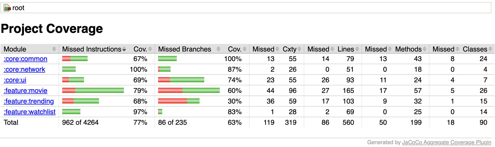

## JaCoCo Aggregate Coverage Plugin
The plugin streamlines the generation of a unified code coverage report across multi-module Android projects. It collects and combines coverage data generated by [JaCoCo](https://github.com/jacoco/jacoco) from all subprojects, providing a detailed and comprehensive view of your project's test coverage.

## Features
- Aggregates JaCoCo coverage reports from multiple modules.
- Generates a unified report for overall test coverage visualization.
- Ideal for multi-module Android projects.
- Easy to apply.

> Note: This plugin does not configure the JaCoCo plugin automatically. You must configure the JaCoCo plugin manually within your project. The JaCoCo Aggregate Coverage Plugin requires the JaCoCo report task to be set up since it utilizes these tasks to aggregate reports.

# 1) Getting started
Integrate the JaCoCo Aggregate Coverage Plugin into your project with these steps:

### Step 1: Update the root `build.gradle[.kts]` file
In your root `build.gradle[.kts]` file, add the following plugin configuration:

```gradle
plugins {
  ...
  id "com.azizutku.jacocoaggregatecoverageplugin" version "[write the latest version]" apply true
}
```

### Step 2: Configure the plugin in the root `build.gradle[.kts]` file
```kotlin
jacocoAggregateCoverage {
    jacocoTestReportTask.set("YOUR_JACOCO_TEST_REPORT_TASK")
    // Other optional configurations
}
```

# 2) Usage
After applying and configuring the plugin, you can generate the aggregated report by running the following command:

```bash
./gradlew aggregateJacocoReports
```
The unified report will be generated at **`build/reports/jacocoAggregated/index.html`** in the root project.

# Configuration
Configure the plugin in your root-level `build.gradle[.kts]` file:
```kotlin
jacocoAggregateCoverage {
    jacocoTestReportTask.set("jacocoTestDebugUnitTestReport")
    // Add the report directory only if you have a custom directory set
    configuredCustomReportsDirectory.set("customJacocoReportDir")
    // Specify the HTML output location if you have a custom one
    configuredCustomHtmlOutputLocation.set("jacocoCustomHtmlFolder")
}
```
- **jacocoTestReportTask**: Required. Specify the task used to generate the JaCoCo report.
- **configuredCustomReportsDirectory**: Optional. Set this if you have a custom reports directory.
- **configuredCustomHtmlOutputLocation**: Optional. Set this if you have a custom directory for the HTML report output.

## Example Aggregated Report


# Contribution
Contributions are welcome! Please feel free to submit a pull request or open an issue on the GitHub repository.

# License
This project is licensed under the MIT License, allowing modification, distribution, and use in your own projects. Additionally, it incorporates resources and code from JaCoCo, which is covered by the Eclipse Public License v2.0. For detailed license terms, please refer to the [LICENSE](https://github.com/azizutku/jacoco-aggregate-coverage-plugin/blob/main/LICENSE) file.
