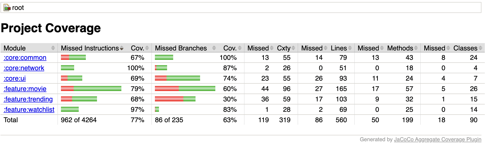

[](https://androidweekly.net/issues/issue-604)
[](https://mailchi.mp/kotlinweekly/kotlin-weekly-388)

# JaCoCo Aggregate Coverage Plugin

Creates an aggregate HTML coverage dashboard from the JaCoCo reports of a multi-module Gradle build.

## Features

- Aggregates JaCoCo HTML reports from multiple modules.
- Links the summary to each module's detailed report.
- Supports Android and JVM multi-module projects.
- Supports Gradle configuration cache, build cache, and Isolated Projects.

> [!IMPORTANT]
> This plugin does not configure JaCoCo or create report tasks. Each participating module must
> already have a task that generates a JaCoCo HTML report.

## Getting started

### 1. Apply the plugin in the root project

In the root `build.gradle.kts`:

```kotlin
plugins {
    id("com.azizutku.jacocoaggregatecoverageplugin") version "0.2.0"
}
```

### 2. Configure participating modules

In each subproject whose coverage should be included:

```kotlin
plugins {
    id("com.azizutku.jacocoaggregatecoverageplugin")
}

jacocoAggregateReport {
    reportTaskName.set("jacocoTestDebugUnitTestReport")
}
```

Set `reportTaskName` to that module's existing JaCoCo HTML report task. The name may differ between
modules. A precompiled script convention plugin can use the same `jacocoAggregateReport` block.
In a binary convention plugin (`Plugin<Project>`), configure the extension through the target
project:

```kotlin
import com.azizutku.jacocoaggregatecoverageplugin.extensions.JacocoAggregateReportPluginExtension
import org.gradle.kotlin.dsl.configure

target.pluginManager.apply("com.azizutku.jacocoaggregatecoverageplugin")
target.extensions.configure<JacocoAggregateReportPluginExtension> {
    reportTaskName.set("createDemoDebugCombinedCoverageReport")
}
```

### 3. Generate the report

```bash
./gradlew aggregateJacocoReports
```

The selected report task runs in each participating module. The aggregate report is written to:

```text
build/reports/jacocoAggregated/index.html
```

## Optional configuration

`reportTaskName` defaults to `jacocoTestReport`. The block in step 2 can be omitted in modules that
use that name.

To change the aggregate output directory in the root project:

```kotlin
jacocoAggregateCoverage {
    aggregatedReportDirectory.set(layout.buildDirectory.dir("reports/allCoverage"))
}
```

### Non-standard report tasks

Standard `JacocoReport` tasks need no output configuration. Other task types, including Android
Gradle Plugin coverage tasks, require their HTML output directory to be registered:

```kotlin
plugins {
    id("com.azizutku.jacocoaggregatecoverageplugin")
}

jacocoAggregateReport {
    reportTaskName.set("createDebugUnitTestCoverageReport")
    register("createDebugUnitTestCoverageReport") {
        htmlOutputLocation.set(layout.buildDirectory.dir("reports/coverage/test/debug"))
    }
}
```

## Compatibility

Version 0.2.x requires Java 17 and is tested with:

- Gradle 8.4 and 9.7.1.
- JaCoCo 0.8.15 HTML reports.
- Android Gradle Plugin 9.4.0 unit-test coverage reports.
- Gradle 9.7.1 Isolated Projects.

The plugin does not pin the JaCoCo version used by the consuming build.

## Example aggregated report



## Contributing

Contributions are welcome. Feel free to open an issue or submit a pull request.

## License

This project is licensed under the MIT License. Generated aggregate reports reuse resources from
the JaCoCo reports supplied by the consuming build; those resources remain covered by the Eclipse
Public License v2.0. See [LICENSE](LICENSE).
